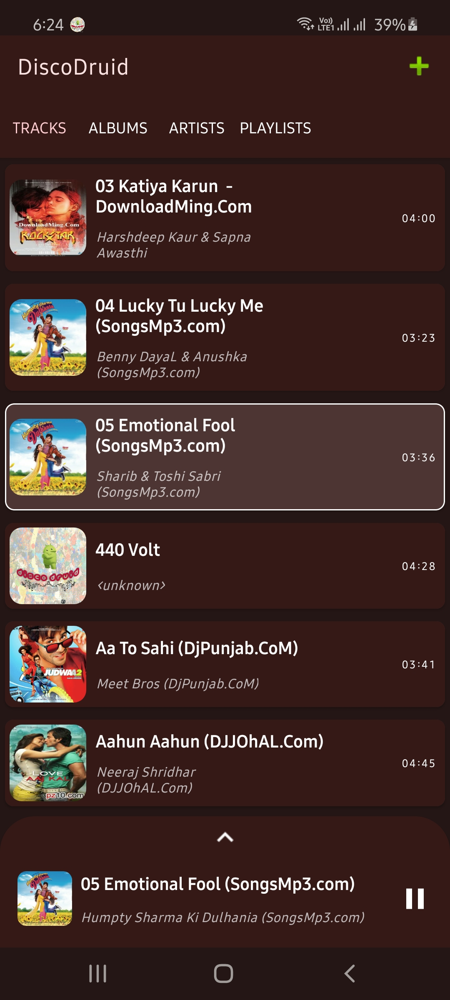
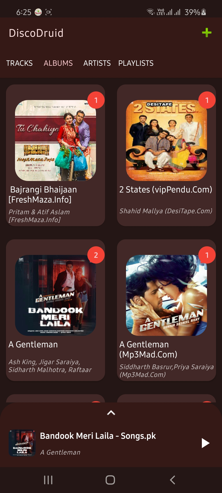
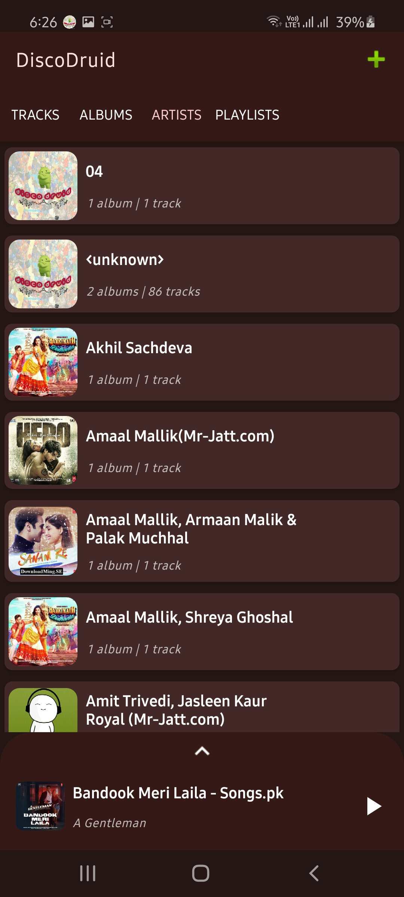

# disco-druid

## Features

Offline music app which plays songs from your device. Built with Day and Night mode using Material Design guidelines. Used shared elements transitions and MotionLayout for smooth animations and transitions between screens. Built in Kotlin with MVVM concepts and Android architecture components. Exoplayer is used for audio streaming and handling UI.

## Outputs

| | | |
|:-------------------------:|:-------------------------:|:-------------------------:|
|  Bottom Sheet animation |  Album details shared elements transition |  View and play all tracks on device
|  View and play all albums on device |  View and play all artists on device |  Show album details
|  Show artist details |  Day mode |
